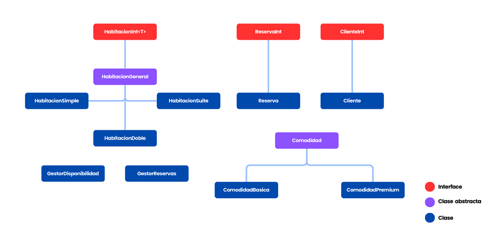

## Sistema de Hotel

Este proyecto tiene la finalidad de gestionar las reservas en un hotel. En general, el sistema nos debe permitir realizar reservas de habitaciones, gestionar su disponibilidad, así como el cálculo de los costos de las reservas, que pueden incluir comodidades y puntos acumulados para el cliente que la realiza. 

## Estructura del Proyecto

